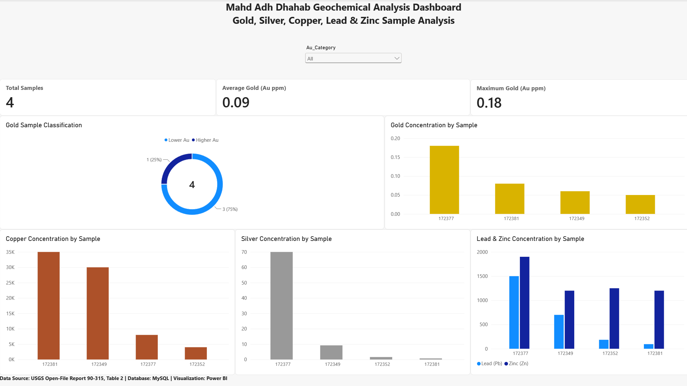

# Mahd Adh Dhahab Geochemical Analysis

## Project Overview
This project demonstrates an end-to-end geochemical data analysis workflow using geological sample data from the Mahd Adh Dhahab area in Saudi Arabia.

The project integrates geological knowledge with SQL, MySQL, and Power BI to organize, analyze, classify, and visualize geochemical sample data.

## Dashboard

## Data Source
USGS Open-File Report 90-315, Table 2.

## Tools Used
- MySQL
- SQL
- Power BI
- Power Query
- DAX
- CSV

## Workflow
1. Prepared geochemical sample data for analysis.
2. Structured the dataset in a MySQL database.
3. Used SQL to analyze Au, Ag, Cu, Pb, and Zn concentrations.
4. Applied CASE logic to classify samples based on gold concentration.
5. Created SQL views and summary statistics.
6. Connected MySQL to Power BI.
7. Built an interactive geochemical analysis dashboard.

## Key Observations
- Sample 172377 recorded the highest gold concentration at 0.18 ppm.
- Sample 172377 recorded the highest silver concentration at 70 ppm.
- Sample 172381 recorded the highest copper concentration at 35,000 ppm.
- 1 of 4 samples was classified as Higher Au using a project threshold of 0.10 ppm.
- Lead and zinc concentrations varied across the analyzed samples.

## Project Files
- `Mahd_Adh_Dhahab_Geochemical_Analysis.pbix` — Power BI dashboard
- `Mahd_Adh_Dhahab_Geochemical_Analysis.sql` — SQL analysis
- `Mahd_Adh_Dhahab_Geochemical_Data.csv` — Dataset
- `Mahd_Adh_Dhahab_Dashboard.png` — Dashboard preview

## Note
This project uses a small four-sample dataset and is intended as a portfolio demonstration of a geological data workflow rather than a comprehensive geological interpretation.
